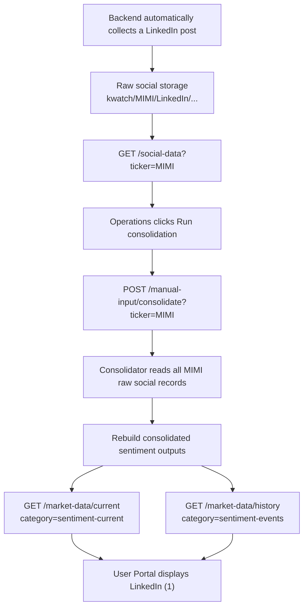

# Social Data Manual Consolidation — Backend Handoff

## Summary

MIMI currently has one LinkedIn record in the raw social-data API, but the
consolidated sentiment APIs still report zero LinkedIn records after Operations
clicks **Run consolidation**.

LinkedIn is collected automatically by the backend. Operations should not need
to upload a LinkedIn CSV. However, the automatically collected record still
needs to be included when Operations manually triggers consolidation.

## Expected data flow



CSV upload is not part of the LinkedIn path. CSV import is only needed for
platforms managed through file upload, such as the current Stocktwits workflow.

## Current observed result

| Stage | Expected | Observed |
|---|---:|---:|
| Raw MIMI LinkedIn records in `GET /social-data` | 1 | 1 |
| Manual consolidation request accepted | Yes | Yes |
| Consolidated MIMI LinkedIn count | 1 | 0 |
| `sentiment-current` changed within two minutes | Yes | No |
| `sentiment-events` changed within two minutes | Yes | No |

This indicates that raw LinkedIn collection is working. The missing record is
between the manual consolidation trigger and the consolidated sentiment output.

### Retest after platform-capitalization correction

Operations triggered MIMI consolidation again after the backend
`LinkedIn`/`linkedIn` capitalization issue was identified. The trigger was
accepted, but neither consolidated API payload changed during the following two
minutes.

This is not a frontend cache result:

- every verification request uses `cache: "no-store"`;
- the consolidation POST clears the frontend authenticated-response cache; and
- the verifier compares the complete fresh `sentiment-current` and
  `sentiment-events` responses with their pre-trigger responses.

The capitalization correction alone has therefore not produced a new
consolidated MIMI sentiment output.

## APIs involved

### 1. Raw social records

```http
GET /social-data?ticker=MIMI&platform=LinkedIn&sort=datetime&order=desc
```

Purpose: confirms that the backend collector has stored the LinkedIn record.

Documented raw storage prefix:

```text
kwatch/{ticker}/{platform}/...
```

For this case:

```text
kwatch/MIMI/LinkedIn/...
```

### 2. Manual consolidation trigger

```http
POST /manual-input/consolidate?ticker=MIMI
Authorization: <id_token>
Content-Type: application/json
```

The documented endpoint invokes the consolidator asynchronously and returns
before processing finishes.

The frontend request body is:

```json
{
  "ticker": "MIMI"
}
```

The backend team clarified that older documentation showing
`input_type: "issued-share"` was an example for reference and was not the
actual API request contract. The frontend does not send `input_type`,
`rebuild_from_date`, or `force_rebuild`.

### 3. Consolidated current sentiment

```http
GET /market-data/current?ticker=MIMI&category=sentiment-current
```

Expected use: current sentiment totals, per-platform counts, distribution, and
the active timeframe data displayed by the user portal.

Expected result after consolidation: the selected applicable timeframe should
include the MIMI LinkedIn record.

### 4. Consolidated sentiment history

```http
GET /market-data/history?ticker=MIMI&category=sentiment-events
```

Expected use: consolidated sentiment timeline/history.

Expected result after consolidation: the LinkedIn record should appear in the
appropriate date/time bucket.

## Backend checks required

Please verify the following:

1. `POST /manual-input/consolidate?ticker=MIMI` invokes the correct Lambda and
   passes `MIMI` throughout the full job.
2. The job reads raw social records under every MIMI platform prefix, including
   `LinkedIn`.
3. Platform matching handles the actual stored spelling and casing, including
   `LinkedIn` versus `Linkedin`.
4. The consolidator does not require a new CSV upload or recent social import
   job before reading an automatically collected LinkedIn record.
5. The consolidation job's selected input date range includes the LinkedIn
   record's effective date.
6. The accepted ticker-only request invokes the social sentiment consolidation
   path, not only another market-data consolidation path.
7. Both consolidated outputs are rewritten when social input changes:
   - `current/MIMI/sentiment-current.json`
   - `history/MIMI/sentiment-events.json`
8. Cache invalidation, object versioning, or API caching does not continue
   serving the previous consolidated files after a successful rebuild.
9. Errors from the asynchronous consolidator are recorded somewhere that
   Operations or support can inspect.
10. The capitalization fix is deployed in the exact Lambda/environment invoked
    by `/manual-input/consolidate`, rather than only in a collector or another
    environment.

## Acceptance test

1. Confirm the raw endpoint returns exactly one MIMI LinkedIn record.
2. Record the current `generatedAt`, `updatedAt`, object version, or equivalent
   metadata for both consolidated sentiment files.
3. Trigger:

   ```http
   POST /manual-input/consolidate?ticker=MIMI
   ```

4. Wait for the asynchronous job to complete.
5. Confirm that at least one output version/timestamp changes.
6. Confirm `sentiment-current` reports LinkedIn count `1` for every timeframe
   that contains the record.
7. Confirm `sentiment-events` contains the LinkedIn record in the correct
   timeline bucket.
8. Refresh the user portal and confirm it displays `LinkedIn (1)`.

## Required clarification from backend

Please confirm which statement describes the intended implementation:

- The existing `/manual-input/consolidate` endpoint rebuilds both manual market
  data and social sentiment; or
- The existing endpoint only rebuilds manual market data and must be extended
  to invoke social consolidation; or
- A separate social consolidation endpoint exists and should be documented for
  the Operations Portal.

## Frontend invariant

The user portal intentionally displays consolidated sentiment only. It must not
replace a missing consolidated LinkedIn count with the raw `/social-data`
record. Once the backend writes the correct consolidated outputs, the existing
frontend data path should display LinkedIn without a CSV upload.
